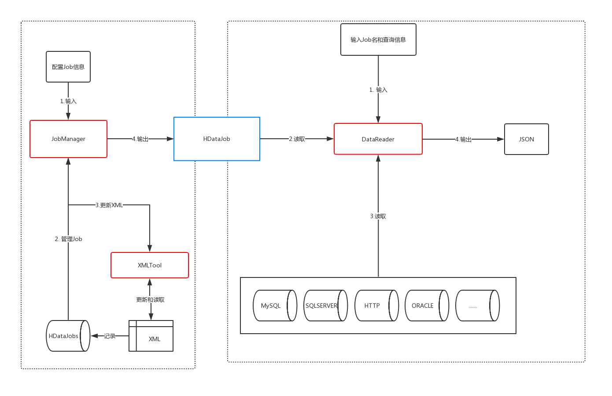

## HData

> 简单的ETL工具，抽取多个数据源数据，按照配置文件中规定数据关系，进行组合，并返回JSON字符串；
> 框架：Spring-boot + Mybatis

### 系统结构



​		说明：红色表示功能模块，单独集成在Module中。蓝色表示类。

### 功能简介

#### 数据源配置管理

> 通过XML配置文件管理多种类型数据源

1. **数据源类型**

   1. MySQL
   2. SQL Server
   3. Http JSON
   4. 待添加其他数据源

2. **数据源配置文件模板**

   1. 示例文件内容

   ```xml
   <?xml version="1.0" encoding="UTF-8"?>
   <Job>
       <!-- JobName必须唯一-->
    <JobName>job_3</JobName>
       <!-- 配置的数据源，不同的数据源有不同的配置 -->
    <Reader>
        <!-- MySQL数据源；SQLServer配置类似 -->
     <Type>MySQL</Type>
     <URL>jdbc:mysql://localhost:3306/hdata?serverTimezone=GMT%2B8</URL>
     <UserName>test</UserName>
     <Password>666666</Password>
     <TableName>data_1</TableName>
     <ShowColumns>CA,CB,CC,CD,CE,CF,CG</ShowColumns>
     <KeyColumns>Name</KeyColumns>
    </Reader>
    <Reader>
     <Type>MySQL</Type>
     <URL>jdbc:mysql://localhost:3306/hdata?serverTimezone=GMT%2B8</URL>
     <UserName>test</UserName>
     <Password>666666</Password>
     <TableName>data_2</TableName>
     <ShowColumns>CA2,CB2,CC2,CD2,CE2,CF2,CG2,CH2</ShowColumns>
     <KeyColumns>Name</KeyColumns>
    </Reader>
   </Job>

   ```

   2. Reader格式
      1. 数据库类型字段：Type（数据源数据库类型），URL（连接数据库URL），UserName（数据库登陆用户名），Password（数据库登陆密码），TableName（表名），KeyColums（主键字段），ShowColumns（除了主键外，需要展示的其他字段）
      2. HTTP JSON类型字段：Type（数据源数据库类型），URL（API URL），UserName（API登陆用户名），Password（API登陆密码），Encoding（编码类型），ParametersFormat（请求参数格式），KeyColums（主键字段），ShowColumns（除了主键外，需要展示的其他字段）

3. 表```hdatajobs```

   1. 功能：使用表```hdatajobs```保存XML文件路径，和其他基本信息

   2. ```SQL
      DROP TABLE IF EXISTS hdatajobs;

      CREATE TABLE hdatajobs (
      	jobid INT PRIMARY KEY NOT NULL AUTO_INCREMENT, -- 自增字段
      	jobname VARCHAR ( 100 ) NOT NULL, -- jobName，一般与文件名，以及XML文件中JobName对应
      	jobpath TEXT NOT NULL, -- XML文件保存路径
      	jobdesc TEXT NOT NULL, -- Job描述信息
      	jobstatus TINYINT NOT NULL DEFAULT 1, -- Job状态（尚未使用到）
      	createtime DATETIME NOT NULL DEFAULT CURRENT_TIMESTAMP, -- 创建时间
      	updatedtime DATETIME NOT NULL DEFAULT CURRENT_TIMESTAMP -- 上次更新时间，代码中自动更新
      )
      ```

#### 数据抽取

> 简介：获取JobName，转换XML配置文件为对象HDataJob，遍历对象中的IDataSourceReader，调用IDataSourceReader中的方法getData()，得到Map类型数据

1. 流程图

   ```mermaid
   graph LR
   JobName和SearchValue-->HDataJob
   HDataJob-->IDataSourceReader
   IDataSourceReader-->getData
   getData-->Map
   ```

2. 参数

   1. JobName：需要使用的Job名
   2. SearchValue：需要查询的关键字的值，字符串类型

#### 数据组合

> 简介: 抽取所有的Map，过滤不需要显示的字段，使用第一个Map的Key字段作为结果的第一个字段，按照Reader的顺序，组合Map中其他字段。

1. 流程图

   ```mermaid
   graph LR
   得到的Maps-->取第一个Map主键置入
   取第一个Map主键置入-->按照Reader声明顺序取剩下字段
   按照Reader声明顺序取剩下字段-->组合Map
   ```

   说明：每次查询只能得到一条记录，组合的Map也只有一条需要显示字段的记录

### 模块简介

> 介绍四个Module的功能和入口类

#### Entity

1. 功能：定义底层对象
   1. HDataJob：XML映射的对象
   2. IDataSourceReader：XML中Reader节点映射的对象
   3. IDataSourceReaderFactory: Reader工厂类

#### Common

1. 功能：定义公共方法和公共工具类
   1. HDataJobXML：XML和HDataJob互相转换工具类
   2. XMLTool：Map和XML文件内容互相转换工具类
   3. FileTool: 读写文件工具类

2. 依赖Entity Module

#### JobManager

1. 功能：管理HDataJob模块
   1. 映射表HDataJobs和HDataJob对象
   2. 转换XML内容和HDataJob.DataSourceReader属性
   3. 提供管理Job的API接口（未完全添加）

2. 依赖Entity和Common Module

#### DataReader

1. 功能：数据抽取导出
   1. 提供接口读取数据（未添加）

2. 依赖JobManager Module

### 未完成工作
1. 使用RESTful规范，完善DataReader，JobManager API接口
2. 添加Swagger API文档
3. 多线程访问测试
4. 其他数据源适配，如HTTP JSON，Oracle等等